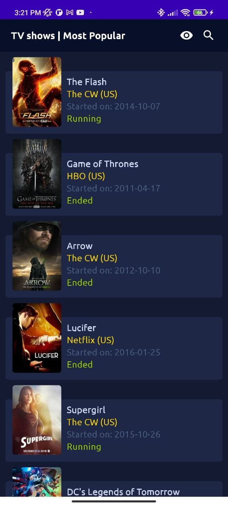
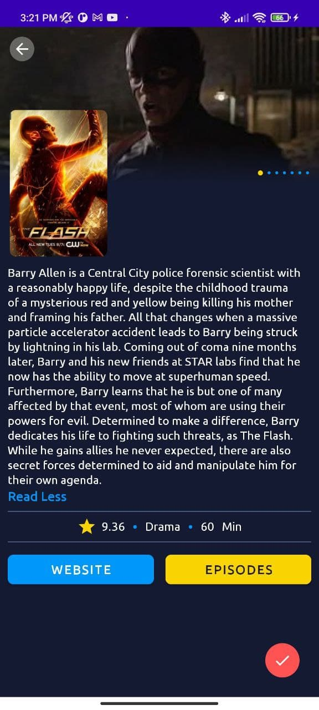
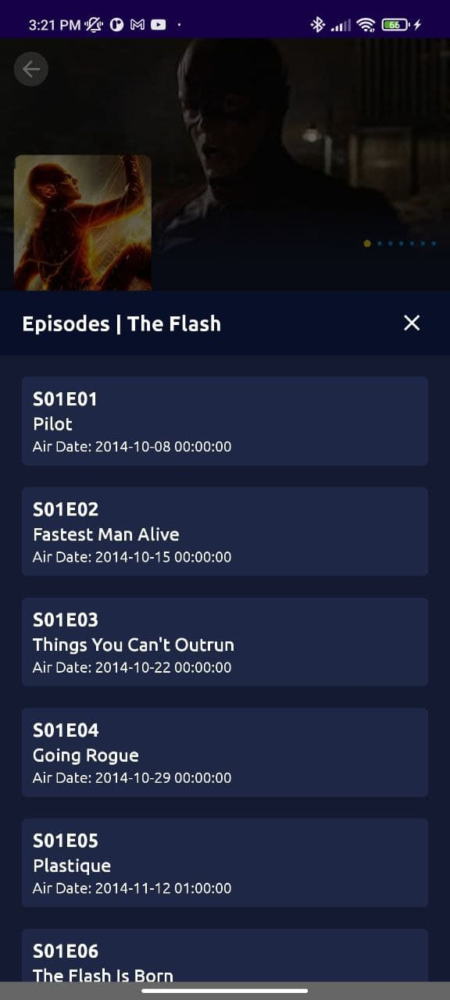

# TvshowApp
This application allow visualize the most popular tv shows and yours descriptions.
Also you can :
* visualize the most popular tv shows
* visualize the details of the tv show selected (description, categori, duration, state)
* save and remove tv show from watchlist 
* search tv Show 
* visualize the episodes of tv show 
* go to website of tvshow

### Phone display:
&ensp;

## Modify watch list (save and remove)
&ensp;
## Search tvShow:

## Library
* [Room Persistence Library](https://developer.android.com/topic/libraries/architecture/room)
* [Retrofit](https://square.github.io/retrofit/)
* [RxJava](https://github.com/ReactiveX/RxJava)
* [Data Binding](https://developer.android.com/topic/libraries/data-binding)
* [Gson](https://github.com/google/gson/)
* [Picasso](https://square.github.io/picasso/)

## API
* [TvShow API](https://www.episodate.com/api)

## App Architecture
* MVVM
* Kotlin
## Developed By

Andres Diaz 
